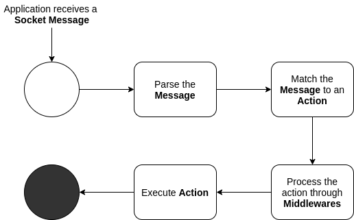

# Socket Conveyor


[](https://scrutinizer-ci.com/code-intelligence)
[](https://scrutinizer-ci.com/g/WordsTree/socket-conveyor/?branch=master)


A WebSocket/Socket message Router for PHP.

This package enables you to work with socket messages with routes strategy, just as if you were specifying routes in [Laravel](https://laravel.com/) or [Slim](https://www.slimframework.com/) projects. For that, you just add an Action Handler implementing the ActionInterface to the SocketMessageRouter and watch the magic happen!

This package assumes that the application is receiving socket messages with a socket server. As an example of how to accomplish that with PHP, you can use the [Swoole PHP Extension](https://www.swoole.co.uk/).


## Installation

```shell
composer require wordstree/socket-conveyor
```


## How it works

The main example is set in the `tests ` directory, but here is how it works:





## Usage

At this library, there is the presumption that the socket message has a *JSON* format. That said, the following standard is expected to be followed by the messages, so they can match specific *Actions*. The minimum format is this:

```json
{
    "action": "sample-action",
    "other-parameters": "here goes other fields necessary for the Actions processing..."
}
```

Notice that the "action" property  is the action's name served by `ActionInterface::getName()`.


In order to use it in your application, you would do something like this:

```php
// Step 1: Prepare an instance of an action that will be responsible to handle
//         a specific Socket Message:

// @var Conveyor\Actions\Interfaces\ActionInterface
$sampleAction = new SampleAction();


// Step 2: Get an instance of the SocketMessageRouter:

// @var Conveyor\SocketHandlers\SocketMessageRouter
$socketRouter = SocketMessageRouter::getInstance();


// Step 3: Add the action's instance to your SocketMessageRouter

// add the action handler
$socketRouter->add($sampleAction);


// Step 4: Prepare as many Middlewares as you need:

// @var Conveyor\ActionMiddlewares\Interfaces\MiddlewareInterface
$sampleMiddleware = new SampleMiddleware;
$sampleMiddleware2 = new SampleMiddleware2;


// Step 5: Link the Middlewares to the Actions you want them to run on.

// add middlewares
$socketRouter->middleware($sampleAction->getName(), $sampleMiddleware);
$socketRouter->middleware($sampleAction->getName(), $sampleMiddleware2);


// Step 6: Add this to process your Socket Messages. If using Swoole, this would go
//         at the "onMessage" event of the Socket Server. If using ReactPHP, this 
//         would go at the "data" event.

$result = ($socketRouter)($data); // or $socketRouter->handle($data)
```

To understand further, check the tests: https://github.com/WordsTree/socket-conveyor/blob/master/tests/SocketMessageRouterTest.php

Important topics:

- If you need to dispatch a custom message back according to the action's functionality, you can pass the $server instance at the `SocketMessageRouter::handle`, also the $fd, so you know which connection to send it to. Check its interface here: https://github.com/WordsTree/socket-conveyor/blob/master/src/SocketHandlers/Interfaces/SocketHandlerInterface.php
- To avoid problems with resilient data in swoole, it is better to create a new instance of `SocketMessageRouter` at the incoming message event of your socket server.


## Motivation

WebSocket procedures are more and more common with PHP, and realtime applications are becoming more often. That said, there is a need for solutions that help to work like that in PHP.


## Tests

Run Command:

```shell
./vendor/bin/phpunit
```


## TODO

- add support to protobuf
