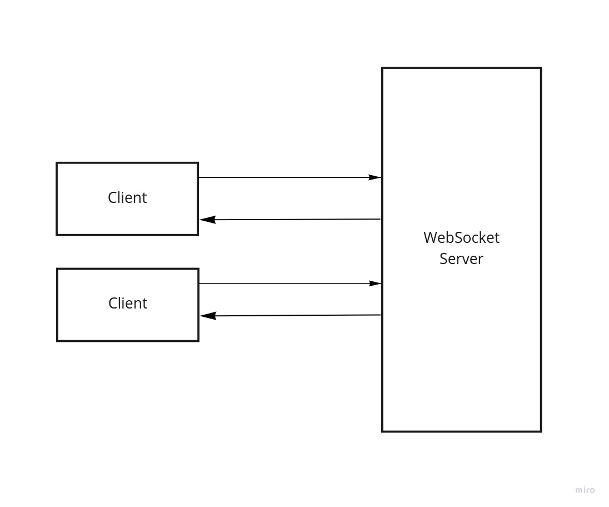
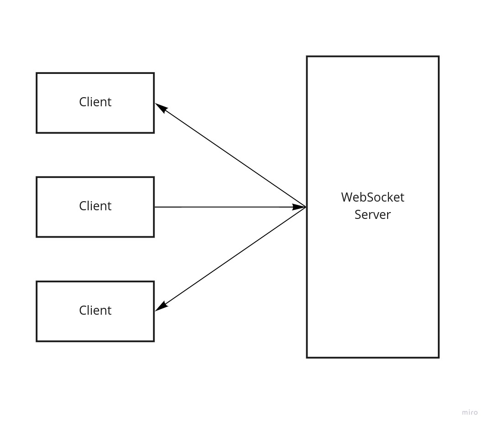
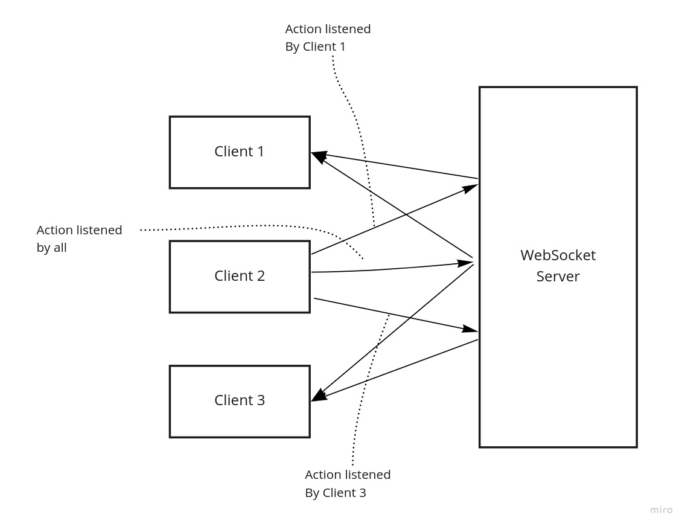

<p align="center">

</p>


[](https://scrutinizer-ci.com/code-intelligence)
[](https://scrutinizer-ci.com/g/kanata-php/socket-conveyor/?branch=master)

> A WebSocket/Socket message Router for PHP

<a href="https://www.buymeacoffee.com/savioresende" target="_blank"></a>

## Prerequisites

- PHP >= 8.0

## Table of contents

- [Installation](#installation)
- [Description](#description)
- [How it works](#how-it-works)
- [Usage](#usage)
    - [Case 1: Simple Use](#case-1-simple-use)
    - [Case 2: Using Channels](#case-2-using-channels)
    - [Case 3: Listening to Actions](#case-3-listening-to-actions)
    - [Case 4: Associate User with Connection](#case-4-associate-user-with-connection)
    - [Case 5: Using Middlewares](#case-5-using-middlewares)
- [Commands](#commands)
- [Tests](#tests)
- [Author](#author)
- [License](#-license)

## Installation

```shell
composer require kanata-php/socket-conveyor
```

## Description

This package enables you to work with socket messages with routes strategy. For that, you just add an Action Handler implementing the `ActionInterface` to the `SocketMessageRouter` and watch the magic happen!

This package assumes that the application is receiving socket messages with a socket server. As an example of how to accomplish that with PHP, you can use the [OpenSwoole](https://openswoole.com/).

This package has a Client NPM package to facilitate the work, go check it here: https://www.npmjs.com/package/socket-conveyor-client.

## How it works

The main example is set in the `tests ` directory, but here is how it works:

<p align="center">

</p>


## Usage

Following we have 4 examples:

**Case 1**: The simple case, where a user communicates in real-time fashion but won't broadcast any data to other users.

**Case 2**: The channel case, where a user communicates with other users in real-time using channels.

**Case 3**: The listener case, where a user can participate in a channel but only listen to specific actions. 

The following we have a basic example in [OpenSwoole](https://openswoole.com).

**Case 4**: Associate an application user id with a connection (fd).

### Case 1: Simple Use

<p align="center">

</p>

At this example the user will receive back a real-time messages from the server after sending a message.

At this library, there is the presumption that the socket message has a *JSON* format. That said, the following standard is expected to be followed by the messages, so they can match specific *Actions*. The minimum format is this:

```json
{
    "action": "sample-action",
    "other-parameters": "here goes other fields necessary for the Actions processing..."
}
```

First, write some action handlers:

```php
require __DIR__.'/vendor/autoload.php';

use Conveyor\Actions\Abstractions\AbstractAction;

class ExampleFirstCreateAction extends AbstractAction
{
    protected string $name = 'example-first-action';
    public function execute(array $data): mixed
    {
        $this->send('Example First Action Executed!', $this->fd);
        return null;
    }
    public function validateData(array $data) : void {}
}

class ExampleSecondCreateAction extends AbstractAction
{
    protected string $name = 'example-second-action';
    public function execute(array $data): mixed
    {
        $this->send('Example Second Action Executed!', $this->fd);
        return null;
    }
    public function validateData(array $data) : void {}
}
```

Second, at your Open Swoole Web Socket server, register `SocketMessageRouter` with your actions at your `OnMessage` event handler:

```php
require __DIR__.'/vendor/autoload.php';

use Swoole\WebSocket\Frame;
use Swoole\WebSocket\Server;
use Conveyor\SocketHandlers\SocketMessageRouter;

$websocket = new Server('0.0.0.0', 8001);
$websocket->on('message', function (Server $server, Frame $frame) {
    echo 'Received message (' . $frame->fd . '): ' . $frame->data . PHP_EOL;
    $socketRouter = new SocketMessageRouter;
    $socketRouter->add(new ExampleFirstCreateAction);
    $socketRouter->add(new ExampleSecondCreateAction);
    $socketRouter($frame->data, $frame->fd, $server);
});

$websocket->start();
```

Thats it! Now, to communicate in real-time with this service, on your HTML you can do something like this:

```html
<div>
    <div><button onclick="sendMessage('example-first-action', 'first')">First Action</button></div>
    <div><button onclick="sendMessage('example-second-action', 'second')">Second Action</button></div>
    <div id="output"></div>
</div>
<script type="text/javascript">
    var websocket = new WebSocket('ws://127.0.0.1:8001');
    websocket.onmessage = function (evt) {
        document.getElementById('output').innerHTML = JSON.parse(evt.data).data;
    };
    function sendMessage(action, message) {
        websocket.send(JSON.stringify({
            'action': action,
            'params': {'content': message}
        }));
    }
</script>
```

How it looks like:

<p align="center">

</p>

### Case 2: Using Channels

<p align="center">

</p>

At this case it is possible for clients sharing a channel to communicate to each other by broadcasting messages and data through this channel.

The procedure here requires one extra step during the instantiation: the connection action. The connection action will link in a persistent manner the connection FD to a channel.

```json
{
    "action": "channel-connect",
    "channel": "channel-name"
}
```

The Actions can be the same as the simple example. The Server initialization (remembering that this example is for OpenSwoole) will be a little different:

To begin with, the actions, when calling for the method "send" will consider the third parameter to point out that they are sending a message to the entire channel, e.g.:

```php
class ExampleFirstCreateAction extends AbstractAction
{
    protected string $name = 'example-first-action';
    public function execute(array $data): mixed
    {
        // This method will broadcast message to the entire channel
        // if we set the third parameter (toChannel) to true.
        $this->send('Example First Action Executed!', null, true);
        return null;
    }
    public function validateData(array $data) : void {}
}
```

The Socker Router instantiation also suffers a small change, so 

```php
require __DIR__.'/vendor/autoload.php';

use Swoole\WebSocket\Frame;
use Swoole\WebSocket\Server;
use Conveyor\SocketHandlers\SocketMessageRouter;

$persistenceService = new SocketChannelsTable; // this is an example of the PersistenceInterface that needs to be set so the Socket Router knows how to persist its data.
$websocket = new Server('0.0.0.0', 8001);
$websocket->on('message', function (Server $server, Frame $frame) use ($persistenceService) {
    echo 'Received message (' . $frame->fd . '): ' . $frame->data . PHP_EOL;
    $socketRouter = new SocketMessageRouter($persistenceService, [
        ExampleFirstCreateAction::class,
        ExampleSecondCreateAction::class,
    ]);
    $socketRouter($frame->data, $frame->fd, $server);
});

$websocket->start();
```

An example of the `Conveyor\Actions\Interfaces\PersistenceInterface` for the persistence of the channels information is the following. Notice that this example uses `Swoole\Table`, but it can use any external persistent storage behind the interface.

```php
use Conveyor\SocketHandlers\Interfaces\PersistenceInterface;
use Swoole\Table;

class SocketChannelsTable implements PersistenceInterface
{
    protected Table $table;

    public function __construct()
    {
        $this->table = new Table(10024);
        $this->table->column('channel', Table::TYPE_STRING, 40);
        $this->table->create();
    }

    public function connect(int $fd, string $channel): void
    {
        $this->table->set($fd, ['channel' => $channel]);
    }

    public function disconnect(int $fd): void
    {
        $this->table->del($fd);
    }

    public function getAllConnections(): array
    {
        $collection = [];
        foreach($this->table as $key => $value) {
            $collection[$key] = $value['channel'];
        }
        return $collection;
    }
    
    public function listen(int $fd, string $action): void
    {
        return; // not needed for this example
    }

    public function getListener(int $fd): array
    {
        return []; // not needed for this example
    }

    public function getAllListeners(): array
    {
        return []; // not needed for this example
    }
}
```

With these changes to the server, you can have different implementations on the client-side. Each implementation, in a different context, connects to a different channel. As an example, we have the following HTML example. When connected, it will make sure the current connection belongs to a given channel. To connect another implementation to a different channel, you just need to use a different channel parameter.

```html
<div>
    <div><button onclick="sendMessage('example-first-action', 'first')">First Action</button></div>
    <div><button onclick="sendMessage('example-second-action', 'second')">Second Action</button></div>
    <div id="output"></div>
</div>
<script type="text/javascript">
    var channel = 'actionschannel';
    var websocket = new WebSocket('ws://127.0.0.1:8001');
    websocket.onopen = function(e) {
        websocket.send(JSON.stringify({
            'action': 'channel-connect',
            'channel': channel,
        }));
    };
    websocket.onmessage = function (evt) {
        document.getElementById('output').innerHTML = JSON.parse(evt.data).data;
    };
    function sendMessage(action, message) {
        websocket.send(JSON.stringify({
            'action': action,
            'params': {'content': message}
        }));
    }
</script>
```

That's all, with this, you would have the following:

<p align="center">

</p>

### Case 3: Listening to Actions

<p align="center">

</p>

At this example clients can filter messages that they receive by adding listeners to the ones they want. If there are not listeners registered, they will receive all.

Let's see the difference from this example from the previous (Using Channels):

At the `SocketMessageRouter` preparation, we have one extra action being called: `AddListenerAction`.

```php
require __DIR__.'/vendor/autoload.php';

use Swoole\WebSocket\Frame;
use Swoole\WebSocket\Server;
use Conveyor\Actions\AddListenerAction;
use Conveyor\SocketHandlers\SocketMessageRouter;

$persistenceService = new SocketChannelsTable; // this is an example of the PersistenceInterface that needs to be set so the Socket Router knows how to persist its data.
$websocket = new Server('0.0.0.0', 8001);
$websocket->on('message', function (Server $server, Frame $frame) use ($persistenceService) {
    echo 'Received message (' . $frame->fd . '): ' . $frame->data . PHP_EOL;
    $socketRouter = new SocketMessageRouter($persistenceService, [
        ExampleFirstCreateAction::class,
        ExampleSecondCreateAction::class,
    ]);
    $socketRouter($frame->data, $frame->fd, $server);
});

$websocket->start();
```

The implementation of the `PersistenceInterface` needs the listening methods implemented:

```php
use Conveyor\SocketHandlers\Interfaces\PersistenceInterface;
use Swoole\Table;

class SocketChannelsTable implements PersistenceInterface
{
    protected Table $table;

    public function __construct()
    {
        $this->table = new Table(10024);
        $this->table->column('channel', Table::TYPE_STRING, 40);
        
        // new field
        $this->table->column('listening', Table::TYPE_STRING, 200);
        
        $this->table->create();
    }

    public function connect(int $fd, string $channel): void
    {
        $this->table->set($fd, ['channel' => $channel]);
    }

    public function disconnect(int $fd): void
    {
        $this->table->del($fd);
    }

    public function getAllConnections(): array
    {
        $collection = [];
        foreach($this->table as $key => $value) {
            $collection[$key] = $value['channel'];
        }
        return $collection;
    }
    
    // new methods:
    
    public function listen(int $fd, string $action): void
    {
        $listening = $this->table->get($fd, 'listening');
        $listeningArray = explode(',', $listening);
        $listeningArray = array_filter($listeningArray);
        $listeningArray[] = $action;
        $this->table->set($fd, [
            'channel' => $this->table->get($fd, 'channel'),
            'listening' => implode(',', $listeningArray),
        ]);
    }

    public function getListener(int $fd): array
    {
        return explode(',', $this->table->get($fd, 'listening'));
    }

    public function getAllListeners(): array
    {
        $collection = [];
        foreach($this->table as $key => $value) {
            $collection[$key] = explode(',', $value['listening']);
        }
        return $collection;
    }
}
```

The client in Javasript then starts listening a specific action by sending a new message at the connection opening:

```html
<div>
    <div><button onclick="sendMessage('example-first-action', 'first')">First Action</button></div>
    <div><button onclick="sendMessage('example-second-action', 'second')">Second Action</button></div>
    <div id="output"></div>
</div>
<script type="text/javascript">
    var channel = 'actionschannel';
    var websocket = new WebSocket('ws://127.0.0.1:8001');
    websocket.onopen = function(e) {
        websocket.send(JSON.stringify({
            'action': 'channel-connect',
            'channel': channel,
        }));
        
        // This starts the process of listening to actions from the current client.
        websocket.send(JSON.stringify({
            'action': 'add-listener',
            'listener': 'example-first-action',
        }));
    };
    websocket.onmessage = function (evt) {
        document.getElementById('output').innerHTML = JSON.parse(evt.data).data;
    };
    function sendMessage(action, message) {
        websocket.send(JSON.stringify({
            'action': action,
            'params': {'content': message}
        }));
    }
</script>
```

Once those changes are in place, you'll be able to see this (notice that we are in the same channel, but both are listening only to the actions that are subscribed for):


### Case 4: Associate User with Connection

This functionality is for applications that need to have associations between connections (fd) and users. This is useful when you need to execute actions that need to know the context and decide upon that. One good example is a server that serves at the same time multiple users, but won't answer users the same way depending on the procedure executed. That way, you can have actions that will process some data and broadcast to connections only what each connection needs to receive for that procedure.

For this functionality, you only need one extra action to be dispatched:

```javascript
websocket.send(JSON.stringify({
    'action': 'assoc-user-to-fd-action',
    'userId': 1,
}));
```

This code will associate the user "1" with the current connection.

> **Important:** This functionality might need some more treatment, so we know for sure that a given user owns a given connection. That can be done by the single key procedure with the application running Socket Conveyor, where you generate one key for a user via an HTTP request, and use that key in the header to be authorized by the actions that need such context. 

### Case 5: Using Middlewares

The usage of middlewares might help to secure your websocket server, making sure specific validations and conditions are met in order to proceed. At Socket Conveyor middlewares are attached to actions at the socket router's instance. The way to do that is as follows:

```php
require __DIR__.'/vendor/autoload.php';

use Swoole\WebSocket\Frame;
use Swoole\WebSocket\Server;
use Conveyor\SocketHandlers\SocketMessageRouter;
use Conveyor\ActionMiddlewares\Interfaces\MiddlewareInterface;

class Middleware1 extends MiddlewareInterface
{
    public function __invoke($payload)
    {
        // do somethign here
        return $payload;
    }
}

$persistenceService = new SocketChannelsTable; // this is an example of the PersistenceInterface that needs to be set so the Socket Router knows how to persist its data.
$websocket = new Server('0.0.0.0', 8001);
$websocket->on('message', function (Server $server, Frame $frame) use ($persistenceService) {
    echo 'Received message (' . $frame->fd . '): ' . $frame->data . PHP_EOL;
    
    // adding with the constructor
    $socketRouter = new SocketMessageRouter($persistenceService, [
        ActionWithoutMiddleware::class,
        [ActionWithMiddleware::class, new Middleware1, function($payload) {return $payload;}],
    ]);
    
    // adding after the instance is set
    $action = new ActionWithMiddleware2;
    $socketRouter->add($action);
    $socketRouter->middleware($action->getName(), new Middleware1);
    $socketRouter->middleware($action->getName(), function($payload) {return $payload;});
    
    $socketRouter->middleware();
    $socketRouter($frame->data, $frame->fd, $server);
});

$websocket->start();
```

Middlewares at Socket Conveyor are callables. Any callable is accepted. This is reason you can add functions as middlewares. Even though the system is pretty flexible on that side, we strongly suggest you to implement the interface `Conveyor\ActionMiddlewares\Interfaces\MiddlewareInterface`.

## Commands

This package comes with a binary command (`./start-ws-server`) to start a managed WebSocket Server. If you don't overwrite the default options, it comes with a sample Server and Client that you can use to build something else or extend and customize. After the installation composer will copy the command to the binary's directory inside vendor (`./vendor/bin/start-ws-server`) of your project's directory.

Once you run the following comment you'll be able to visit `localhost:8080` and see the manager to start or stop the server.

```shell
php ./vendor/bin/start-ws-server
```

<p align="center">

</p>

## Tests

Run Command:

```shell
./vendor/bin/phpunit
```

## Author

👤 **Savio Resende**

* Website: https://savioresende.com
* GitHub: [@lotharthesavior](https://github.com/lotharthesavior)

## 📝 License

Copyright © 2022 [Savio Resende](https://github.com/lotharthesavior).

This project is [MIT](https://github.com/kefranabg/readme-md-generator/blob/master/LICENSE) licensed.
